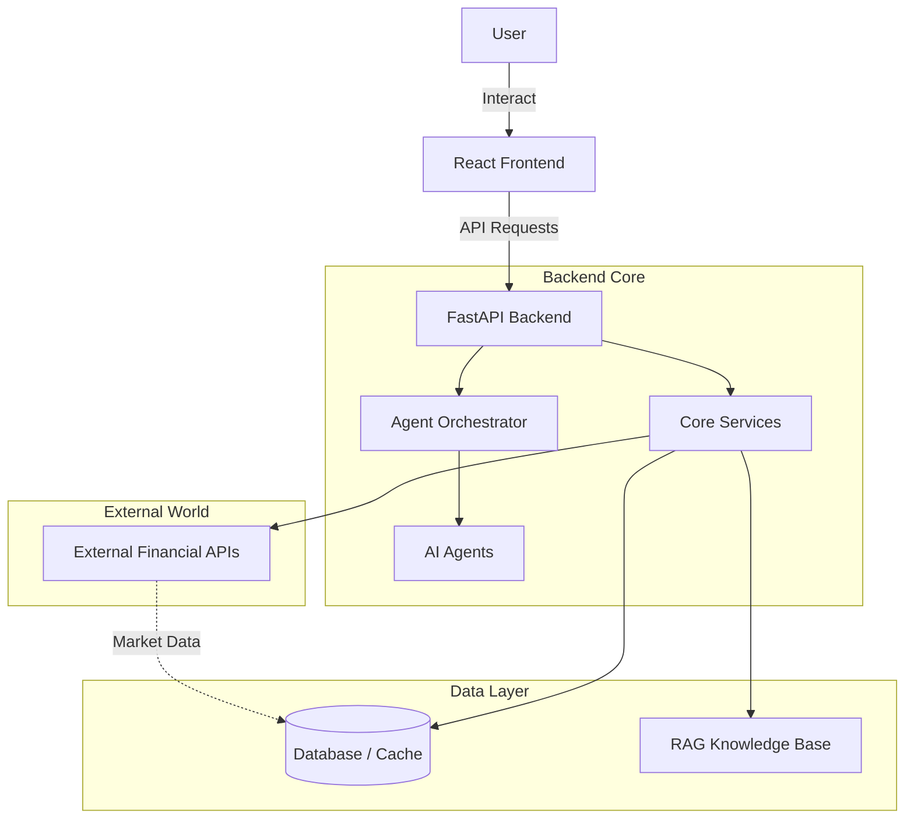
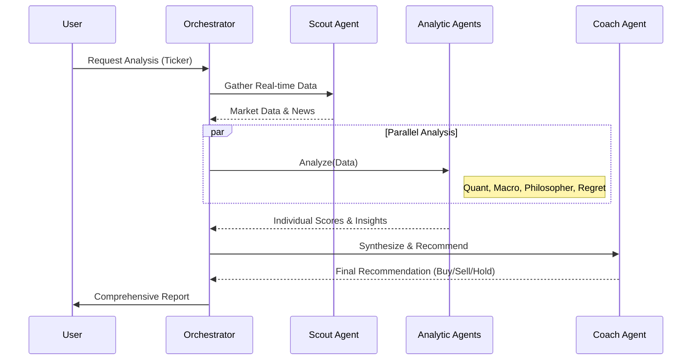
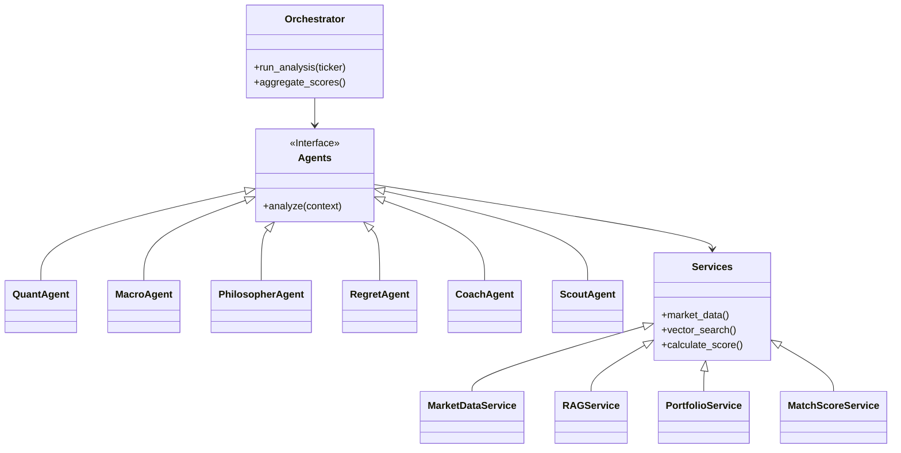

# System Architecture

## High-Level Architecture
The VOIS-ELIDA system follows a modern client-server architecture with a React frontend and a FastAPI backend, powered by a Multi-Agent System (MAS).

## Agent System Workflow
The core interaction is managed by the `Orchestrator`, which coordinates specialized agents to analyze financial data from different perspectives.

## Detailed Component Architecture

### Backend Components
The backend is structured into distinct layers for modularity and scalability.

### Data Providers & Services
- **CoingeckoService**: Crypto market data.
- **FredService**: Federal Reserve Economic Data.
- **RbiService**: Reserve Bank of India data.
- **RAGService**: Retrieval-Augmented Generation for context.
- **CacheService**: Performance optimization.
