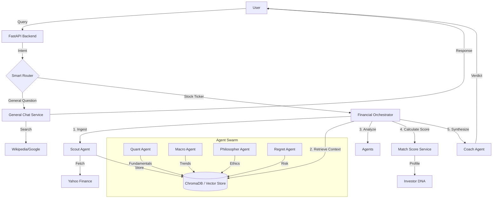

# Architecture Guide

## 🏗 System Overview

ELIDA relies on a **Hub-and-Spoke** architecture where a central **Orchestrator** manages data flow between the User, Data Sources, the RAG Knowledge Base, and specialized AI Agents.

## 🔄 Data Flow Diagram

## 🤖 The Agents

Each agent has a specific persona and specialized prompt:

| Agent | Role | Tools/Data |
|-------|------|------------|
| **Scout** | Data Ingestion | YahooQuery, yfinance. Fetches Price, P/E, News. |
| **Quant** | Fundamental Analysis | Analyzes Balance Sheets, Profitability, Valuation. |
| **Macro** | Market Context | Analyzes VIX, Bond Yields, Inflation Trends. |
| **Philosopher** | Ethical Alignment | Checks against User's "Sin Stock" filters. |
| **Regret** | Risk Simulation | Simulates worst-case scenarios (Pre-Mortem). |
| **Coach** | Synthesis | Combines all insights into a final recommendation. |

## 🧬 smart Routing

The system uses Regex and Keyword matching to classify intent:
1.  **Ticker Pattern** (e.g., "TCS.NS", "AAPL"): Trigger full Financial Analysis.
2.  **General Text** (e.g., "What is EBITDA?"): Trigger General Research (Lightweight RAG).

## 💾 RAG Implementation
- **Vector Store**: ChromaDB (Transient/Persistent).
- **Embedding**: `sentence-transformers/all-MiniLM-L6-v2`.
- **Strategy**: 
    - **Step 1**: Ingest Asset Data (Financials, News) -> Chunk -> Embed.
    - **Step 2**: Agents query specifically for their domain (e.g., Quant asks for "financial ratios").
    - **Step 3**: Agents write their *Insights* back to RAG.
    - **Step 4**: Coach queries for "Agent Insights" to synthesize.
