# ELIDA Architecture Guide

## 🏗️ System Overview

ELIDA (Enhanced Learning Investment Decision Advisor) uses a **Multi-Agent AI Architecture** with:
- **React Frontend** for the user interface
- **FastAPI Backend** as the orchestration layer
- **Specialized AI Agents** for domain-specific analysis
- **RAG Knowledge Base** for context-aware retrieval
- **Persistent Storage** for user profiles and history

---

## 🔄 High-Level Architecture

```mermaid
flowchart TB
    subgraph Frontend["🖥️ React Frontend"]
        UI[Dashboard & Analysis UI]
        Chat[Chatbot Interface]
        Profile[User Profile]
    end

    subgraph API["⚡ FastAPI Backend"]
        Router{Smart Router}
        Auth[JWT Auth]
        Orch[Orchestrator]
    end

    subgraph Agents["🤖 AI Agent Swarm"]
        Scout[🔍 Scout Agent]
        Quant[📊 Quant Agent]
        Macro[🌍 Macro Agent]
        Phil[🧠 Philosopher Agent]
        Regret[⚠️ Regret Agent]
        Coach[🎯 Coach Agent]
    end

    subgraph Data["💾 Data Layer"]
        RAG[(ChromaDB<br/>Vector Store)]
        DB[(SQLite<br/>Users & History)]
        Cache[Redis Cache]
    end

    subgraph External["🌐 External Services"]
        Yahoo[Yahoo Finance]
        LLM[Groq / Ollama / Gemini]
    end

    UI --> Router
    Chat --> Router
    Profile --> Auth
    
    Router -->|Stock Query| Orch
    Router -->|General Chat| LLM
    
    Orch -->|1. Collect Data| Scout
    Scout --> Yahoo
    Scout -->|Store| RAG
    
    Orch -->|2. Analyze| Quant
    Orch -->|2. Analyze| Macro
    Orch -->|2. Analyze| Phil
    Orch -->|2. Analyze| Regret
    
    Quant --> RAG
    Macro --> RAG
    Phil --> RAG
    Regret --> RAG
    
    Orch -->|3. Synthesize| Coach
    Coach --> LLM
    Coach -->|Final Verdict| UI
    
    Auth --> DB
    Orch -->|Save History| DB

    style Frontend fill:#1a1a2e,stroke:#7c3aed,color:#fff
    style API fill:#16213e,stroke:#10b981,color:#fff
    style Agents fill:#0f3460,stroke:#f59e0b,color:#fff
    style Data fill:#1a1a2e,stroke:#3b82f6,color:#fff
    style External fill:#252525,stroke:#6b7280,color:#fff
```



---

## 📊 Analysis Pipeline

```mermaid
sequenceDiagram
    participant U as 👤 User
    participant F as 🖥️ Frontend
    participant O as ⚡ Orchestrator
    participant S as 🔍 Scout
    participant A as 🤖 Agents
    participant C as 🎯 Coach
    participant D as 💾 Database

    U->>F: Enter Stock Symbol (e.g., TCS.NS)
    F->>O: POST /analyze/{ticker}
    
    O->>S: Collect Market Data
    S-->>O: Financials, News, Technicals
    
    note over A: Sequential Analysis
        O->>A: Quant Analysis
        O->>A: Macro Analysis
        O->>A: Philosophy Check
        O->>A: Risk Simulation
    end note
    
    A-->>O: Agent Insights (Scores + Reasoning)
    
    O->>C: Synthesize All Insights
    C-->>O: Final Verdict + Recommendation
    
    O->>D: Save to History
    O-->>F: Complete Analysis Result
    F-->>U: Display Dashboard
```

---

## 🤖 Agent Specifications

| Agent | 🎯 Role | 📈 Metrics | 🔧 Data Sources |
|-------|---------|-----------|-----------------|
| **Scout** | Data Collection | Price, Volume, News | Yahoo Finance, Screener.in |
| **Quant** | Fundamentals | P/E, ROE, Debt/Equity | Balance Sheet, Ratios |
| **Macro** | Market Context | VIX, Yields, Trends | Economic Indicators |
| **Philosopher** | Ethics & Quality | Moat, ESG, Management | Business Model |
| **Regret** | Risk Assessment | Downside, Volatility | Scenario Simulation |
| **Coach** | Synthesis | Match Score, Verdict | All Agent Insights |

---

## 🧬 Investor DNA Matching

```mermaid
flowchart LR
    subgraph Profile["👤 Investor Profile"]
        Risk[Risk Tolerance]
        Horizon[Investment Horizon]
        Goals[Financial Goals]
        Avoid[Sectors to Avoid]
    end

    subgraph Analysis["📊 Stock Analysis"]
        Volatility[Stock Volatility]
        Growth[Growth Potential]
        Sector[Sector/Industry]
        Dividend[Dividend Profile]
    end

    subgraph Match["🎯 Match Score"]
        Score[0-100 Score]
        Verdict[BUY/HOLD/SELL]
        Reasons[Fit & Concern Reasons]
    end

    Profile --> Match
    Analysis --> Match
    Match --> Score
    Match --> Verdict
    Match --> Reasons

    style Profile fill:#7c3aed,stroke:#fff,color:#fff
    style Analysis fill:#10b981,stroke:#fff,color:#fff
    style Match fill:#f59e0b,stroke:#fff,color:#fff
```



---

## 💾 Data Storage

| Store | Technology | Purpose |
|-------|------------|---------|
| **Vector DB** | ChromaDB | RAG embeddings, semantic search |
| **Relational DB** | SQLite | Users, Profiles, History |
| **Cache** | In-Memory | Market data, API responses |

---

## 🔐 Authentication Flow


---

## 🚀 Tech Stack

| Layer | Technology |
|-------|------------|
| **Frontend** | React 19 + Vite + Tailwind CSS |
| **Backend** | FastAPI + Python 3.11 |
| **AI/LLM** | Gemini API / Ollama (Local) |
| **Vector Store** | ChromaDB |
| **Database** | SQLite + SQLAlchemy |
| **Data Sources** | Yahoo Finance, Screener.in |

