# ELIDA — Architecture Blueprint

> AI-Powered Investment Decision Support System (v2.1)

---

## High-Level Architecture

```mermaid
graph TB
    subgraph Client["🖥️ Frontend — React + Vite (Port 5173)"]
        UI["React SPA"]
        Pages["Pages: Dashboard | Analysis | Portfolio | Compare | History | Profile | Learn | Settings"]
        Components["Components: AgentCard | MatchScoreCard | PriceChart | RegretWarningBox | Chatbot"]
        AuthUI["Auth: Login | Register"]
        API_Client["api.js — Axios HTTP Client"]
    end

    subgraph Server["⚙️ Backend — FastAPI + Uvicorn (Port 8000)"]
        direction TB
        
        subgraph API_Layer["API Layer"]
            Main["main.py — FastAPI App"]
            Routers["Routers: Profile | History"]
            Auth["JWT Auth — Bearer Token"]
            RateLimit["Rate Limiter"]
            CORS["CORS Middleware"]
        end

        subgraph Orchestration["🎯 Orchestration Engine"]
            Orchestrator["FinancialOrchestrator"]
        end

        subgraph Agent_Layer["🤖 Multi-Agent System"]
            Scout["🔍 Scout Agent — Data Collection"]
            Quant["📊 Quant Agent — Fundamentals"]
            Macro["🌍 Macro Agent — Market Conditions"]
            Philosopher["🧠 Philosopher Agent — Ethics/ESG"]
            Regret["⚠️ Regret Agent — Downside Risk"]
            Coach["🏆 Coach Synthesizer — Final Verdict"]
            BaseAgent["BaseAgent — LLM Fallback Chain"]
        end

        subgraph Services["📦 Services Layer"]
            MatchScore["MatchScoreService — DNA-weighted Scoring"]
            RAG["RAGService — ChromaDB Vector Store"]
            TickerSearch["TickerSearchService"]
            DataValidator["DataValidator"]
            SanityChecker["SanityChecker"]
            ProfileSvc["ProfileService"]
            HistorySvc["HistoryService"]
            PortfolioSvc["PortfolioService"]
            CacheSvc["CacheService"]
        end

        subgraph External_Data["🌐 External Data Sources"]
            Yahoo["Yahoo Finance API"]
            Screener["Screener.in"]
            FRED["FRED — Macro Data"]
            RBI["RBI — India Rates"]
            CoinGecko["CoinGecko — Crypto"]
        end

        subgraph LLM_Providers["🧠 LLM Providers (Fallback Chain)"]
            OpenRouter["1️⃣ OpenRouter — stepfun/step-3.5-flash"]
            Groq["2️⃣ Groq"]
            Ollama["3️⃣ Ollama — qwen2.5:7b"]
            Gemini["4️⃣ Google Gemini"]
        end

        subgraph Storage["💾 Persistence"]
            SQLite["SQLite — Users, History, Portfolios"]
            ChromaDB["ChromaDB — Vector Embeddings"]
        end
    end

    UI --> API_Client
    API_Client -->|HTTP REST| Main
    Main --> Auth
    Main --> Routers
    Main --> Orchestrator

    Orchestrator --> Scout
    Orchestrator --> RAG
    Scout --> Yahoo
    Scout --> Screener
    Scout --> FRED
    Scout --> RBI

    Orchestrator -->|Parallel| Quant
    Orchestrator -->|Parallel| Macro
    Orchestrator -->|Parallel| Philosopher
    Orchestrator -->|Parallel| Regret

    Quant --> BaseAgent
    Macro --> BaseAgent
    Philosopher --> BaseAgent
    Regret --> BaseAgent
    Coach --> BaseAgent

    BaseAgent --> OpenRouter
    BaseAgent -.->|fallback| Groq
    BaseAgent -.->|fallback| Ollama
    BaseAgent -.->|fallback| Gemini

    Orchestrator --> MatchScore
    Orchestrator --> Coach
    MatchScore --> SQLite
    RAG --> ChromaDB
    HistorySvc --> SQLite
    ProfileSvc --> SQLite

    classDef frontend fill:#667eea,stroke:#5a67d8,color:#fff
    classDef backend fill:#48bb78,stroke:#38a169,color:#fff
    classDef agent fill:#ed8936,stroke:#dd6b20,color:#fff
    classDef service fill:#4fd1c5,stroke:#38b2ac,color:#fff
    classDef external fill:#fc8181,stroke:#f56565,color:#fff
    classDef storage fill:#b794f4,stroke:#9f7aea,color:#fff

    class UI,Pages,Components,AuthUI,API_Client frontend
    class Main,Routers,Auth,RateLimit,CORS,Orchestrator backend
    class Scout,Quant,Macro,Philosopher,Regret,Coach,BaseAgent agent
    class MatchScore,RAG,TickerSearch,DataValidator,SanityChecker,ProfileSvc,HistorySvc,PortfolioSvc,CacheSvc service
    class Yahoo,Screener,FRED,RBI,CoinGecko,OpenRouter,Groq,Ollama,Gemini external
    class SQLite,ChromaDB storage
```



---

## Component Inventory

### Backend (`backend/app/`)

| Layer | File | Purpose |
|-------|------|---------|
| **Entry** | `main.py` | FastAPI app, all API endpoints, middleware |
| **Orchestration** | `orchestrator.py` | Pipeline orchestrator — ingest → agents → score → coach |
| **Agents** | `agents/base.py` | BaseAgent with LLM fallback chain, token tracking |
| | `agents/scout.py` | Data collection from Yahoo, Screener, FRED, RBI |
| | `agents/quant.py` | Fundamental analysis (P/E, D/E, margins, growth) |
| | `agents/macro.py` | Macroeconomic trend analysis (VIX, rates, inflation) |
| | `agents/philosopher.py` | ESG/ethical alignment scoring |
| | `agents/regret.py` | Downside risk scenario simulation |
| | `agents/coach.py` | Multi-agent synthesis into final verdict |
| **Services** | `services/rag_service.py` | ChromaDB vector store + sentence-transformers |
| | `services/match_score_service.py` | DNA-weighted match scoring engine |
| | `services/ticker_search_service.py` | Company name → ticker symbol resolution |
| | `services/data_validator.py` | Financial data validation |
| | `services/sanity_checker.py` | Anomaly detection in financial data |
| | `services/fred_service.py` | FRED API for US macro data |
| | `services/rbi_service.py` | RBI repo rate fetcher for India macro |
| | `services/screener_service.py` | Screener.in fallback for Indian stocks |
| | `services/coingecko_service.py` | CoinGecko for crypto data |
| | `services/profile_service.py` | User profile CRUD |
| | `services/history_service.py` | Analysis history persistence |
| | `services/portfolio_service.py` | Multi-asset portfolio scanning |
| | `services/cache_service.py` | Response caching |
| **Models** | `models/investor_dna.py` | InvestorDNA, MatchScoreBreakdown, MatchResult |
| **Auth** | `auth/` | JWT token auth, user registration |
| **Core** | `core/config.py` | Pydantic settings from `.env` |
| | `core/logging.py` | Structured logging |
| | `core/exceptions.py` | Custom exception hierarchy |

### Frontend (`frontend/src/`)

| Layer | File | Purpose |
|-------|------|---------|
| **Entry** | `App.tsx` | React Router with 10+ routes |
| **Pages** | `dashboard/Dashboard` | Main dashboard with search |
| | `analysis/AnalysisResultsPage` | Full analysis with agent cards |
| | `portfolio/PortfolioPage` | Multi-stock portfolio view |
| | `comparison/ComparePage` | Side-by-side stock comparison |
| | `history/HistoryPage` | Past analysis history |
| | `ProfilePage` | Investor DNA settings |
| | `LearnPage` | Investment education |
| | `settings/SettingsPage` | App settings |
| **Components** | `AgentCard.tsx` | Individual agent result display |
| | `MatchScoreCard.jsx` | Radial match score visualization |
| | `PriceChart.jsx` | Stock price chart |
| | `RegretWarningBox.jsx` | Risk warning display |
| | `Chatbot.tsx` | AI chat assistant |
| | `InvestorDNASettings.jsx` | DNA profile editor |

---

## Match Score Weighting Formula

```
Match Score = (Quant × 0.35) + (Macro × 0.10) + (Philosophy × 0.10) + (Risk × 0.20) + (DNA × 0.25)
```

| Component | Weight | Source Agent | Score Range |
|-----------|--------|-------------|-------------|
| Fundamental | 35% | Quant Agent | 0-100 |
| Macro | 10% | Macro Agent | 0-100 |
| Philosophy | 10% | Philosopher Agent | 0-100 |
| Risk | 20% | Regret Agent | 0-100 (inverted) |
| DNA Match | 25% | InvestorDNA model | 0-100 |

---

## LLM Fallback Chain

```
OpenRouter (stepfun/step-3.5-flash:free)
    ↓ fails
Groq (fast cloud)
    ↓ fails
Ollama (qwen2.5:7b local)
    ↓ fails
Google Gemini
    ↓ fails
Rule-based fallback (sector defaults)
```
