# ELIDA — Technical Flow Diagram

> Step-by-step data flow through the system for a stock analysis request

---

## 1. Full Analysis Pipeline Flow

```mermaid
sequenceDiagram
    participant U as 👤 User
    participant FE as 🖥️ React Frontend
    participant API as ⚙️ FastAPI
    participant AUTH as 🔐 JWT Auth
    participant ORCH as 🎯 Orchestrator
    participant SCOUT as 🔍 Scout Agent
    participant YF as 📈 Yahoo Finance
    participant SCR as 🇮🇳 Screener.in
    participant FRED as 🏛️ FRED API
    participant RAG as 🧠 RAG (ChromaDB)
    participant AGENTS as 🤖 4 Agents (Parallel)
    participant LLM as 🧠 OpenRouter LLM
    participant MATCH as 📊 Match Score Service
    participant COACH as 🏆 Coach Synthesizer
    participant DB as 💾 SQLite

    Note over U,DB: Phase 1 — User Input & Authentication
    U->>FE: Search "MRF" or "TSLA"
    FE->>API: GET /api/v1/resolve-ticker?query=MRF
    API-->>FE: {symbol: "MRF.NS", name: "MRF Limited"}
    FE->>API: POST /api/v1/analyze/MRF.NS
    API->>AUTH: Validate JWT Bearer Token
    AUTH-->>API: user_id: "usr_123"

    Note over ORCH,RAG: Phase 2 — Data Ingestion
    API->>ORCH: analyze_asset("MRF.NS", investor_dna)
    ORCH->>ORCH: Clear old RAG cache for MRF.NS
    ORCH->>SCOUT: collect_data("MRF.NS")
    SCOUT->>YF: Fetch financials, technicals, news
    SCOUT->>SCR: Fallback for Indian stocks
    SCOUT->>FRED: GDP, inflation, interest rates
    SCOUT-->>ORCH: {financials, technicals, macro, news}
    ORCH->>RAG: Store documents + embeddings

    Note over ORCH,LLM: Phase 3 — Multi-Agent Analysis (Parallel)
    ORCH->>RAG: Query context for MRF.NS
    RAG-->>ORCH: Retrieved documents + metadata
    ORCH->>ORCH: Inject company identifier + cached data

    par Parallel Agent Execution
        ORCH->>AGENTS: Quant Agent (fundamentals)
        AGENTS->>LLM: P/E, D/E, margins, growth analysis
        LLM-->>AGENTS: JSON {score: 35, strengths, weaknesses}

        ORCH->>AGENTS: Macro Agent (market conditions)
        AGENTS->>LLM: VIX, rates, inflation analysis
        LLM-->>AGENTS: JSON {score: 45, trend: "Neutral"}

        ORCH->>AGENTS: Philosopher Agent (ESG/ethics)
        AGENTS->>LLM: Governance, moat, social impact
        LLM-->>AGENTS: JSON {score: 45, alignment: "Medium"}

        ORCH->>AGENTS: Regret Agent (downside risk)
        AGENTS->>LLM: Risk scenarios, drawdown estimates
        LLM-->>AGENTS: JSON {score: 27, risk_level: "High"}
    end

    AGENTS-->>ORCH: All 4 agent results

    Note over MATCH,DB: Phase 4 — Match Score Calculation
    ORCH->>MATCH: calculate_match_score(agent_results, asset_data, investor_dna)
    MATCH->>MATCH: Extract scores from each agent
    MATCH->>MATCH: Apply DNA matching (risk, style, ethics)
    MATCH->>MATCH: Weighted formula: Q×0.35 + M×0.10 + P×0.10 + R×0.20 + D×0.25
    MATCH-->>ORCH: MatchResult {score: 47%, recommendation: "Hold"}

    Note over RAG,COACH: Phase 5 — Coach Synthesis
    ORCH->>RAG: Store agent insights
    ORCH->>RAG: Query all insights for MRF.NS
    RAG-->>ORCH: Top 10 agent insights
    ORCH->>COACH: Synthesize insights
    COACH->>LLM: Synthesize for MRF.NS with anti-hallucination guardrails
    LLM-->>COACH: JSON {verdict, action, key_risks, catalysts}
    COACH-->>ORCH: Final synthesis

    Note over API,DB: Phase 6 — Response & Persistence
    ORCH->>DB: Save analysis to history
    ORCH-->>API: Complete analysis result
    API-->>FE: JSON response with all agent data
    FE-->>U: Render Dashboard + Agent Cards + Match Score
```

---

## 2. LLM Call Flow (Per Agent)

```mermaid
flowchart TD
    A["Agent.call_llm(prompt)"] --> B{OpenRouter Available?}
    B -->|Yes| C["🦄 Call OpenRouter\nstepfun/step-3.5-flash:free"]
    C --> D{Response OK?}
    D -->|Yes| K["✅ Return Response"]
    D -->|No| E{Groq Available?}

    B -->|No| E
    E -->|Yes| F["⚡ Call Groq"]
    F --> G{Response OK?}
    G -->|Yes| K
    G -->|No| H{Ollama Running?}

    E -->|No| H
    H -->|Yes| I["🦙 Call Ollama\nqwen2.5:7b"]
    I --> J{Response OK?}
    J -->|Yes| K
    J -->|No| L{Gemini Available?}

    H -->|No| L
    L -->|Yes| M["🚀 Call Gemini"]
    M --> N{Response OK?}
    N -->|Yes| K
    N -->|No| O{Fallback Func?}

    L -->|No| O
    O -->|Yes| P["📋 Rule-based Fallback\n(sector defaults)"]
    P --> K
    O -->|No| Q["❌ Error: Analysis unavailable"]

    K --> R["📊 Track Token Usage"]
    R --> S["Return to Agent"]

    style C fill:#667eea,color:#fff
    style F fill:#48bb78,color:#fff
    style I fill:#ed8936,color:#fff
    style M fill:#fc8181,color:#fff
    style P fill:#b794f4,color:#fff
    style Q fill:#e53e3e,color:#fff
```

---

## 3. Data Ingestion & RAG Flow

---

## 4. Authentication Flow

```mermaid
sequenceDiagram
    participant U as 👤 User
    participant FE as 🖥️ Frontend
    participant API as ⚙️ Backend
    participant DB as 💾 SQLite

    Note over U,DB: Registration
    U->>FE: Fill registration form
    FE->>API: POST /api/v1/auth/register {email, password}
    API->>API: Hash password (bcrypt)
    API->>DB: INSERT user
    API-->>FE: {user_id, token}
    FE->>FE: Store JWT in localStorage

    Note over U,DB: Login
    U->>FE: Enter credentials
    FE->>API: POST /api/v1/auth/login {email, password}
    API->>DB: Verify credentials
    API->>API: Generate JWT token
    API-->>FE: {access_token, token_type: "bearer"}

    Note over U,DB: Authenticated Request
    FE->>API: GET /api/v1/analyze/TSLA\nHeaders: Authorization: Bearer <token>
    API->>API: Decode & validate JWT
    API->>DB: Load user's InvestorDNA
    API-->>FE: Analysis with personalized DNA match
```

