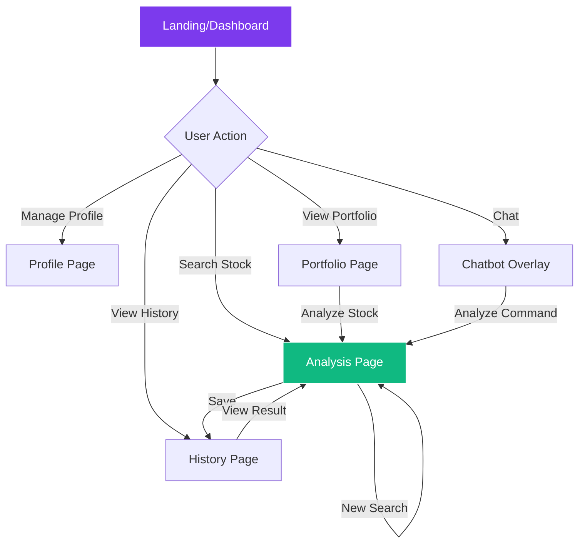

# ELIDA UI Wireframes

This document provides wireframe layouts for all major screens in the ELIDA application.

---

## 📱 Application Structure

```
ELIDA App
├── 🏠 Dashboard
├── 📊 Analysis Page
├── 📜 History Page
├── 👤 Profile Page
├── 💼 Portfolio Page
└── 💬 Chatbot (Overlay)
```

---

## 1. 🏠 Dashboard Page

```
┌─────────────────────────────────────────────────────────────────┐
│  🟣 ELIDA                              [Profile] [Logout]       │
├─────────────────────────────────────────────────────────────────┤
│                                                                 │
│  ┌─────────────────────────────────────────────────────────┐   │
│  │  ✨ Investment Analysis                                  │   │
│  │  ┌──────────────────────────────────┐  ┌──────────┐     │   │
│  │  │ 🔍 Enter stock symbol...         │  │ Analyze  │     │   │
│  │  └──────────────────────────────────┘  └──────────┘     │   │
│  └─────────────────────────────────────────────────────────┘   │
│                                                                 │
│  ┌──────────┐ ┌──────────┐ ┌──────────┐ ┌──────────┐          │
│  │ 5        │ │ Live     │ │ 87%      │ │ 0        │          │
│  │ Agents   │ │ Data     │ │ Accuracy │ │ Recent   │          │
│  └──────────┘ └──────────┘ └──────────┘ └──────────┘          │
│                                                                 │
│  ┌────────────────────────────┐  ┌─────────────────────────┐   │
│  │  📜 Recent Analyses        │  │  📈 Live Market         │   │
│  │  ─────────────────────     │  │  ─────────────────────  │   │
│  │  No recent analyses        │  │  RELIANCE.NS   ₹1,592   │   │
│  │  Start by analyzing!       │  │  TCS.NS        ₹3,250   │   │
│  │                            │  │  AAPL          $276     │   │
│  │                            │  │  ┌─────────────────┐    │   │
│  │                            │  │  │ + Add Stock     │    │   │
│  │                            │  │  └─────────────────┘    │   │
│  └────────────────────────────┘  └─────────────────────────┘   │
│                                                                 │
│                                                    ┌─────┐      │
│                                                    │ 💬  │      │
│                                                    └─────┘      │
└─────────────────────────────────────────────────────────────────┘
```

---

## 2. 📊 Analysis Page

```
┌─────────────────────────────────────────────────────────────────┐
│  🟣 ELIDA                              [Profile] [Logout]       │
├─────────────────────────────────────────────────────────────────┤
│                                                                 │
│  ┌─────────────────────────────────────────────────────────┐   │
│  │  📊 Stock Analysis                                       │   │
│  │  ┌──────────────────────────────────┐  ┌──────────┐     │   │
│  │  │ 🔍 Enter symbol (e.g., TCS.NS)   │  │ Analyze  │     │   │
│  │  └──────────────────────────────────┘  └──────────┘     │   │
│  └─────────────────────────────────────────────────────────┘   │
│                                                                 │
│  ┌─────────────────────────────────────────────────────────┐   │
│  │  🔄 Analysis in Progress...                              │   │
│  │  ─────────────────────────────────────────────────────  │   │
│  │  ┌──────────┐ ┌──────────┐ ┌──────────┐ ┌──────────┐   │   │
│  │  │ Scout    │ │ Quant    │ │ Macro    │ │ Coach    │   │   │
│  │  │ ✓ Done   │ │ Running  │ │ Pending  │ │ Pending  │   │   │
│  │  └──────────┘ └──────────┘ └──────────┘ └──────────┘   │   │
│  └─────────────────────────────────────────────────────────┘   │
│                                                                 │
└─────────────────────────────────────────────────────────────────┘
```

### Analysis Results View

```
┌─────────────────────────────────────────────────────────────────┐
│  📊 TCS.NS Analysis Results                                     │
├─────────────────────────────────────────────────────────────────┤
│                                                                 │
│  ┌─────────────────────┐  ┌──────────────────────────────────┐ │
│  │  🎯 Match Score     │  │  📈 Market Data                  │ │
│  │  ┌───────────────┐  │  │  Price: ₹3,250.70                │ │
│  │  │      87       │  │  │  Change: +0.72%                  │ │
│  │  │    /100       │  │  │  P/E: 23.81                      │ │
│  │  │  STRONG BUY   │  │  │  Market Cap: 11.76T              │ │
│  │  └───────────────┘  │  └──────────────────────────────────┘ │
│  └─────────────────────┘                                        │
│                                                                 │
│  ┌──────────────────────────────────────────────────────────┐  │
│  │  🤖 Agent Insights                                        │  │
│  │  ┌─────────────┐ ┌─────────────┐ ┌─────────────┐         │  │
│  │  │ 📊 Quant    │ │ 🌍 Macro    │ │ 🧠 Phil     │         │  │
│  │  │ Score: 88   │ │ Score: 82   │ │ Score: 90   │         │  │
│  │  │ Strong ROE  │ │ IT sector   │ │ Good moat   │         │  │
│  │  │ ...         │ │ bullish...  │ │ ...         │         │  │
│  │  └─────────────┘ └─────────────┘ └─────────────┘         │  │
│  └──────────────────────────────────────────────────────────┘  │
│                                                                 │
│  ┌──────────────────────────────────────────────────────────┐  │
│  │  🎯 Coach Verdict                                         │  │
│  │  TCS is a core holding for any long-term portfolio...    │  │
│  │  ┌────────────────┐  ┌────────────────┐                  │  │
│  │  │ 💾 Save        │  │ 🔄 New Search  │                  │  │
│  │  └────────────────┘  └────────────────┘                  │  │
│  └──────────────────────────────────────────────────────────┘  │
└─────────────────────────────────────────────────────────────────┘
```

---

## 3. 📜 History Page

```
┌─────────────────────────────────────────────────────────────────┐
│  🟣 ELIDA                              [Profile] [Logout]       │
├─────────────────────────────────────────────────────────────────┤
│                                                                 │
│  📜 Analysis History                           [🔄 Refresh]     │
│  View your past stock analyses                                  │
│                                                                 │
│  ┌──────────────────────────────────────────────────────────┐  │
│  │ 🔍 Search history...                                      │  │
│  └──────────────────────────────────────────────────────────┘  │
│                                                                 │
│  ┌──────────────────────────────────────────────────────────┐  │
│  │  Asset         │ Type       │ Date          │ Action     │  │
│  │─────────────────────────────────────────────────────────│  │
│  │  📊 TCS.NS     │ analysis   │ Jan 3, 2026   │    →       │  │
│  │  📊 RELIANCE   │ analysis   │ Jan 2, 2026   │    →       │  │
│  │  📊 AAPL       │ analysis   │ Jan 1, 2026   │    →       │  │
│  └──────────────────────────────────────────────────────────┘  │
│                                                                 │
└─────────────────────────────────────────────────────────────────┘
```

---

## 4. 👤 Profile Page

```
┌─────────────────────────────────────────────────────────────────┐
│  🟣 ELIDA                              [Profile] [Logout]       │
├─────────────────────────────────────────────────────────────────┤
│                                                                 │
│  👤 Investor Profile                                            │
│  Customize your investment preferences                          │
│                                                                 │
│  ┌──────────────────────────────────────────────────────────┐  │
│  │  🧬 Your Investor DNA                                     │  │
│  │                                                           │  │
│  │  Risk Tolerance                                           │  │
│  │  ┌─────────[●]────────────────────────────────────┐      │  │
│  │  Conservative                              Aggressive     │  │
│  │                                                           │  │
│  │  Investment Horizon                                       │  │
│  │  ○ Short-term (< 1 year)                                 │  │
│  │  ● Medium-term (1-5 years)                               │  │
│  │  ○ Long-term (5+ years)                                  │  │
│  │                                                           │  │
│  │  Financial Goals                                          │  │
│  │  ☑ Capital Growth    ☐ Regular Income                    │  │
│  │  ☐ Capital Safety    ☑ Wealth Preservation               │  │
│  │                                                           │  │
│  │  Sectors to Avoid                                         │  │
│  │  ☑ Tobacco    ☐ Alcohol    ☐ Gambling    ☐ Defense       │  │
│  │                                                           │  │
│  │  ┌────────────────────────────────────────────────┐      │  │
│  │  │              💾 Save Profile                    │      │  │
│  │  └────────────────────────────────────────────────┘      │  │
│  └──────────────────────────────────────────────────────────┘  │
│                                                                 │
└─────────────────────────────────────────────────────────────────┘
```

---

## 5. 💼 Portfolio Page

```
┌─────────────────────────────────────────────────────────────────┐
│  🟣 ELIDA                              [Profile] [Logout]       │
├─────────────────────────────────────────────────────────────────┤
│                                                                 │
│  💼 My Portfolio                            [+ Add Holdings]    │
│  Track and analyze your investments                             │
│                                                                 │
│  ┌──────────────────────────────────────────────────────────┐  │
│  │  📊 Portfolio Overview                                    │  │
│  │  Total Value: ₹5,25,000    Change: +2.3%                 │  │
│  └──────────────────────────────────────────────────────────┘  │
│                                                                 │
│  ┌──────────────────────────────────────────────────────────┐  │
│  │  Holdings                                                 │  │
│  │─────────────────────────────────────────────────────────│  │
│  │  TCS.NS        100 shares    ₹3,25,000    +5.2%    [⚡]  │  │
│  │  RELIANCE.NS   50 shares     ₹79,650     -1.5%    [⚡]  │  │
│  │  INFY.NS       80 shares     ₹1,47,620   +3.8%    [⚡]  │  │
│  │                                                           │  │
│  │  [⚡] = Click to run AI analysis                         │  │
│  └──────────────────────────────────────────────────────────┘  │
│                                                                 │
│  ┌────────────────────────────────────────────────────┐        │
│  │           🤖 Scan Entire Portfolio                  │        │
│  └────────────────────────────────────────────────────┘        │
│                                                                 │
└─────────────────────────────────────────────────────────────────┘
```

---

## 6. 💬 Chatbot (Overlay)

```
                                    ┌─────────────────────────────┐
                                    │  🤖 ELIDA Assistant      ✕  │
                                    ├─────────────────────────────┤
                                    │                             │
                                    │  ┌───────────────────────┐  │
                                    │  │ 🤖 Hi! I'm ELIDA.     │  │
                                    │  │ How can I help you    │  │
                                    │  │ with investing today? │  │
                                    │  └───────────────────────┘  │
                                    │                             │
                                    │  ┌───────────────────────┐  │
                                    │  │ What is P/E ratio? 👤 │  │
                                    │  └───────────────────────┘  │
                                    │                             │
                                    │  ┌───────────────────────┐  │
                                    │  │ 🤖 P/E ratio is the   │  │
                                    │  │ Price-to-Earnings     │  │
                                    │  │ ratio. It measures... │  │
                                    │  └───────────────────────┘  │
                                    │                             │
                                    │  Quick Actions:             │
                                    │  [Analyze TCS] [Compare]    │
                                    │                             │
                                    ├─────────────────────────────┤
                                    │  ┌─────────────────┐ [Send] │
                                    │  │ Ask anything... │        │
                                    │  └─────────────────┘        │
                                    └─────────────────────────────┘
```

---

## 🎨 Design Tokens

| Element | Color | Usage |
|---------|-------|-------|
| **Primary** | `#7C3AED` (Purple) | Buttons, Highlights |
| **Success** | `#10B981` (Green) | Positive changes |
| **Error** | `#EF4444` (Red) | Negative changes |
| **Background** | `#0A0A0F` | Main background |
| **Surface** | `#1A1A2E` | Cards, panels |
| **Text** | `#FFFFFF` | Primary text |
| **Secondary** | `#9CA3AF` | Muted text |

---

## 📐 Responsive Breakpoints

| Breakpoint | Width | Layout |
|------------|-------|--------|
| **Mobile** | < 640px | Single column |
| **Tablet** | 640-1024px | 2 columns |
| **Desktop** | > 1024px | Full layout |

---

## 🔗 Navigation Flow


