# ELIDA — Workflow Diagrams

> User workflows, agent internal processes, and DevOps pipelines

---

## 1. User Workflow — Stock Analysis

```mermaid
flowchart TD
    Start(["👤 User Opens App"]) --> Login{"Logged In?"}
    Login -->|No| Auth["Login / Register"]
    Auth --> SetDNA["Set Investor DNA Profile"]
    SetDNA --> Dashboard
    Login -->|Yes| Dashboard["📊 Dashboard"]

    Dashboard --> Search["🔍 Search Stock\n(name or ticker)"]
    Search --> Resolve["Auto-resolve Ticker\nApple → AAPL\nMRF → MRF.NS"]
    Resolve --> Analyze["▶️ Run Analysis"]

    Analyze --> Loading["⏳ Loading Screen\nAgent-by-agent progress"]
    Loading --> Results["📋 Analysis Results Page"]

    Results --> View_Agents["View Agent Cards\nQuant | Macro | Philosopher | Regret"]
    Results --> View_Match["View Match Score\nRadial gauge + breakdown"]
    Results --> View_Coach["View Coach Verdict\nFinal recommendation"]
    Results --> View_Chart["View Price Chart\nHistorical data"]

    View_Agents --> DeepDive["🔎 Agent Deep Dive\nDetailed analysis text"]
    View_Match --> DNA_Edit["✏️ Edit Investor DNA\nRecalculate match"]

    Results --> Compare["⚔️ Compare with\nanother stock"]
    Results --> Save["💾 Saved to History\nautomatically"]

    Compare --> CompareView["Side-by-side\nagent comparison"]
    Save --> History["📜 History Page\nAll past analyses"]

    History --> Revisit["Re-view any\npast analysis"]

    Dashboard --> Portfolio["📁 Portfolio Scanner"]
    Portfolio --> MultiAdd["Add multiple tickers"]
    MultiAdd --> BatchAnalysis["Batch analysis\n(background)"]
    BatchAnalysis --> PortfolioView["Portfolio overview\nwith match scores"]

    style Start fill:#667eea,color:#fff
    style Results fill:#48bb78,color:#fff
    style Loading fill:#ed8936,color:#fff
    style CompareView fill:#4fd1c5,color:#fff
```

---

## 2. Agent Internal Workflow

---

## 3. Score Derivation Workflow

```mermaid
flowchart LR
    subgraph Quant["📊 Quant Agent"]
        Q_LLM["LLM extracts\nscore directly"] --> Q_Score["Score: 0-100"]
    end

    subgraph Macro["🌍 Macro Agent"]
        M_Cat["LLM → Trend Category"] --> M_Map["Bullish: 75\nNeutral: 50\nBearish: 30"]
        M_Map --> M_Adj["× (0.7 + 0.3 × confidence/100)"]
        M_Adj --> M_Score["Score: 0-100"]
    end

    subgraph Phil["🧠 Philosopher Agent"]
        P_Cat["LLM → Alignment"] --> P_Map["High: 80\nMedium: 55\nLow: 30"]
        P_Map --> P_Adj["× (0.7 + 0.3 × confidence/100)"]
        P_Adj --> P_Score["Score: 0-100"]
    end

    subgraph Regret["⚠️ Regret Agent"]
        R_Cat["LLM → Risk Level"] --> R_Map["Low: 80\nMedium: 55\nHigh: 30\n(inverted)"]
        R_Map --> R_Adj["× (0.7 + 0.3 × confidence/100)"]
        R_Adj --> R_Score["Score: 0-100"]
    end

    subgraph Match["📊 Match Score Service"]
        Q_Score --> Weighted
        M_Score --> Weighted
        P_Score --> Weighted
        R_Score --> Weighted
        DNA["DNA Match\n(risk + style + ethics)"] --> Weighted
        Weighted["Weighted Sum\nQ×35% + M×10%\nP×10% + R×20%\nDNA×25%"] --> Final["Match Score\n0-100%"]
    end

    Final --> Rec{"Recommendation"}
    Rec -->|"≥75"| Buy["✅ Strong Buy"]
    Rec -->|"65-74"| MildBuy["📈 Buy"]
    Rec -->|"45-64"| Hold["⏸️ Hold"]
    Rec -->|"30-44"| MildSell["📉 Sell"]
    Rec -->|"<30"| Sell["❌ Strong Sell"]

    style Final fill:#667eea,color:#fff
    style Buy fill:#48bb78,color:#fff
    style Sell fill:#e53e3e,color:#fff
```

---

## 4. Orchestrator Pipeline Workflow

---

## 5. DevOps & Startup Workflow

